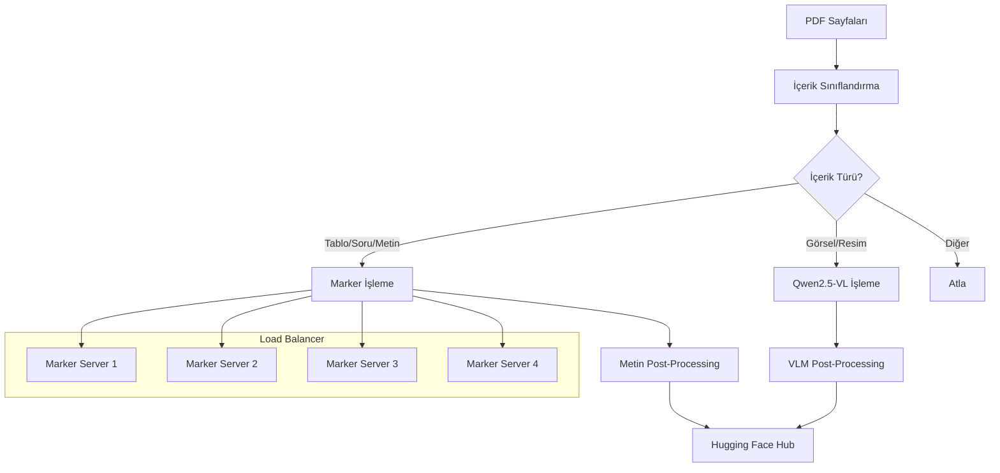

# 🚀 PDF Router - Akıllı PDF İşleme Sistemi

<div align="center">


**PDF sayfalarını içerik türüne göre otomatik sınıflandırıp, uygun AI modellerine yönlendiren akıllı sistem**

[🚀 Hızlı Başlangıç](#-hızlı-başlangıç) • [📋 Özellikler](#-özellikler) • [⚙️ Kurulum](#️-kurulum) • [🔧 Kullanım](#-kullanım) • [📊 Mimari](#-mimari)

</div>

---

## 🎯 Proje Hakkında

PDF Router, PDF sayfalarını içerik türüne göre otomatik olarak sınıflandırıp, her içerik türü için en uygun AI modelini kullanarak işleyen akıllı bir sistemdir. Marker ve Qwen2.5-VL gibi farklı AI modellerini kullanarak PDF içeriğini optimize edilmiş şekilde işler.

### 🔥 Ana Özellikler

- **🧠 Akıllı Sınıflandırma**: PDF sayfalarını içerik türüne göre otomatik sınıflandırır
- **🔄 Çoklu İşleme Modülü**: Marker (tablo/soru/metin) ve Qwen2.5-VL (görsel içerik) desteği
- **⚖️ Load Balancing**: Marker servisleri için round-robin yük dengeleme
- **🌊 Streaming İşleme**: Büyük veri setlerini bellek dostu şekilde işler
- **🤗 Hugging Face Entegrasyonu**: Sonuçları otomatik olarak HF Hub'a yükler
- **🛡️ Hata Toleransı**: Robust hata yönetimi ve fallback mekanizmaları
- **📊 Detaylı Loglama**: Her aşamada kapsamlı debug çıktıları

---

## 🚀 Hızlı Başlangıç

### 1️⃣ Repository'yi Klonlayın
```bash
git clone <repository-url>
cd pdf-router
```

### 2️⃣ Gerekli Paketleri Yükleyin
```bash
pip install -r requirements.txt
```

### 3️⃣ Environment Değişkenlerini Ayarlayın
```bash
# .env dosyası oluşturun
echo "HF_TOKEN=your_huggingface_token" >> .env
echo "VLLM_API_URL=http://localhost:8000" >> .env
echo "VLLM_API_KEY=your_api_key" >> .env
```

### 4️⃣ Servisleri Başlatın
```bash
# Tüm servisleri otomatik başlat (önerilen)
sh run_job.sh

# Veya manuel olarak
sh start_marker_1.sh    # Marker servisleri
sh start_vllm_server.sh # vLLM servisi
python main.py run.yaml # Ana işlem
```

---

## 📋 Sistem Gereksinimleri

### 💻 Donanım
- **GPU**: CUDA destekli (önerilen: 8GB+ VRAM)
- **RAM**: En az 16GB (önerilen: 32GB+)
- **Disk**: Yeterli alan (geçici dosyalar için)

### 🐍 Yazılım
- **Python**: 3.8+
- **CUDA**: 11.8+ (GPU için)
- **Slurm**: Cluster ortamı için

### 📦 Ana Bağımlılıklar
```
datasets>=2.14.0
vllm>=0.2.0
openai>=1.0.0
requests>=2.28.0
loguru>=0.7.0
PIL>=9.0.0
```

---

## ⚙️ Konfigürasyon

### 📄 `run.yaml` Dosyası
```yaml
# Model ve Veri Seti
model_name: "Qwen/Qwen2.5-VL-32B-Instruct"
ds_name: "orcn/predictions"                    # Giriş veri seti
output_ds_name: "sghosts/orcun_processed"      # Çıkış veri seti

# İşleme Seçenekleri
use_vlm: false                                 # HTTP client kullan
use_marker: true                               # Marker kullan
debug: true                                    # Debug modu

# Streaming ve Performans
streaming: true                                # Streaming modu
skip_existing: false                           # Mevcut split'leri atla
push_mode: overwrite                           # Çıkış modu
limit: 10                                      # Test için limit

# GPU Ayarları
tensor_parallel_size: 4                        # GPU sayısı
gpu_memory_utilization: 0.8                    # GPU bellek kullanımı
max_model_len: 32000                           # Maksimum model uzunluğu
```

---

## 🔧 Kullanım

### 🎯 Temel Kullanım
```bash
python main.py run.yaml
```

### 🚀 Tüm Servisleri Başlatma
```bash
sh run_job.sh
```

### 🔧 Manuel Servis Yönetimi
```bash
# Marker servisleri
sh start_marker_1.sh

# vLLM servisi (Slurm)
sh start_vllm_server.sh

# Ana işlem
python main.py run.yaml
```

### 📊 Gelişmiş Seçenekler
```bash
# Debug modu ile
python main.py run.yaml --debug

# Belirli split ile
python main.py run.yaml --start-from-split 0 --until-split 5

# Limit ile test
python main.py run.yaml --limit 100
```

---

## 📊 Mimari

### 🏗️ Sistem Mimarisi


### 🏷️ İçerik Sınıflandırması

| Sınıf | İşleme Modülü | Açıklama | Confidence |
|-------|---------------|----------|------------|
| `Tablo` | Marker | Tablo içeriği | > 0.5 |
| `Soru` | Marker | Soru metinleri | > 0.5 |
| `Metin` | Marker | Düz metin içerik | > 0.5 |
| `Resim` | Qwen2.5-VL | Görsel içerik | > 0.5 |
| `Resim/Tablo Açıklaması` | Qwen2.5-VL | Görsel açıklamaları | > 0.5 |
| `Kapak Sayfası` | Qwen2.5-VL | Kapak sayfaları | > 0.5 |
| `İçindekiler` | Atla | İçindekiler sayfası | - |

---

## 🔧 Marker Konfigürasyonu

### 📋 Marker Servisleri
```bash
# 4 farklı portta çalışan Marker servisleri
CUDA_VISIBLE_DEVICES=0 marker_server --port 8001
CUDA_VISIBLE_DEVICES=1 marker_server --port 8002
CUDA_VISIBLE_DEVICES=2 marker_server --port 8003
CUDA_VISIBLE_DEVICES=3 marker_server --port 8004
```

### 🔄 Load Balancing
- **Round-robin** yük dengeleme
- **Otomatik failover**
- **Thread-safe** implementasyon

### 📤 Marker API Payload
```json
{
    "filepath": "/tmp/tmpbzniuzcs.png",
    "page_range": null,
    "languages": null,
    "force_ocr": true,
    "paginate_output": false,
    "output_format": "markdown"
}
```

---

## 📁 Çıktı Yapısı

### 🤗 Hugging Face Hub
- **Hedef**: `https://huggingface.co/datasets/sghosts/orcun_processed`
- **Format**: Hugging Face Datasets
- **İçerik**: İşlenmiş metinler + metadata

### 📝 Log Dosyaları
```
logs/
├── marker_server_1.log    # Port 8001
├── marker_server_2.log    # Port 8002
├── marker_server_3.log    # Port 8003
├── marker_server_4.log    # Port 8004
└── vllm_server_*.log      # vLLM servisi
```

### 📊 İşleme Modları

#### 🌊 Streaming Modu
```yaml
streaming: true
```
- ✅ Büyük veri setlerini bellek dostu işler
- ✅ Her split bittiğinde anında yükler
- ✅ RAM kullanımını optimize eder

#### 📦 Batch Modu
```yaml
streaming: false
vlm_batch_size: 8
```
- ✅ Tüm veriyi bellekte tutar
- ✅ Daha hızlı işleme
- ✅ Daha fazla RAM gerektirir

#### 🔄 Append Modu
```yaml
push_mode: append
```
- ✅ Mevcut verilerle birleştirir
- ✅ Duplicate kontrolü yapar
- ✅ Incremental güncelleme

---

## 🛠️ Hata Ayıklama

### 📊 Log Kontrolü
```bash
# Marker servisleri
tail -f logs/marker_server_*.log

# vLLM servisi
tail -f logs/vllm_server_*.log

# Ana işlem
python main.py run.yaml 2>&1 | tee processing.log
```

### 🔍 Yaygın Sorunlar

#### 1. **Marker Servisleri Başlamıyor**
```bash
# GPU bellek kontrolü
nvidia-smi

# Port çakışması kontrolü
netstat -tulpn | grep :800

# Marker logları
cat logs/marker_server_*.log
```

#### 2. **vLLM Bağlantı Hatası**
```bash
# API URL kontrolü
curl http://10.128.41.142:8000/v1/models

# Environment değişkenleri
echo $VLLM_API_URL
echo $VLLM_API_KEY
```

#### 3. **Hugging Face Yükleme Hatası**
```bash
# Token kontrolü
echo $HF_TOKEN

# İnternet bağlantısı
ping huggingface.co
```

#### 4. **Veri Seti Yüklenmiyor**
```bash
# Veri seti kontrolü
python -c "import datasets; print(datasets.load_dataset('orcn/predictions', streaming=True))"

# Split kontrolü
python -c "import datasets; print(datasets.get_dataset_config_names('orcn/predictions'))"
```

---

## 📈 Performans Optimizasyonu

### 🎯 GPU Ayarları
```yaml
tensor_parallel_size: 4        # GPU sayısına göre ayarlayın
gpu_memory_utilization: 0.8    # Bellek kullanımını optimize edin
```

### 💾 Bellek Ayarları
```yaml
vlm_batch_size: 8              # VLM batch boyutu
buffer_size: 256               # RAM buffer boyutu
```

### ⚡ Streaming vs Batch
- **Streaming**: Büyük veri setleri için (önerilen)
- **Batch**: Küçük veri setleri için

### 🔧 Confidence Threshold
```python
# router.py
labels_list = [l for l in labels_list if float(l.get('confidence', 0.0)) > 0.5]
```

---

## 🧪 Test ve Geliştirme

### 🚀 Hızlı Test
```bash
# Limit ile test
python main.py run.yaml --limit 10

# Debug modu ile
python main.py run.yaml --debug

# Belirli split ile
python main.py run.yaml --start-from-split 0 --until-split 1
```

### 🔬 Unit Testler
```bash
# Test çalıştırma
python -m pytest tests/

# Coverage raporu
python -m pytest --cov=router tests/
```

### 📊 Benchmark
```bash
# Performans testi
python benchmark.py --samples 1000

# Memory profiling
python -m memory_profiler main.py run.yaml
```

---

## 🤝 Katkıda Bulunma

### 🔀 Geliştirme Süreci
1. **Fork** yapın
2. **Feature branch** oluşturun (`git checkout -b feature/amazing-feature`)
3. **Commit** yapın (`git commit -m 'Add amazing feature'`)
4. **Push** yapın (`git push origin feature/amazing-feature`)
5. **Pull Request** oluşturun

### 📝 Kod Standartları
- **PEP 8** Python kod standardı
- **Type hints** kullanımı
- **Docstring** zorunluluğu
- **Unit test** coverage > 80%

### 🐛 Bug Report
- **Issue** oluşturun
- **Log dosyalarını** paylaşın
- **Sistem konfigürasyonunu** belirtin
- **Reproducible steps** sağlayın

---

## 📄 Lisans

Bu proje **MIT lisansı** altında lisanslanmıştır.

```
MIT License

Copyright (c) 2025 PDF Router

Permission is hereby granted, free of charge, to any person obtaining a copy
of this software and associated documentation files (the "Software"), to deal
in the Software without restriction, including without limitation the rights
to use, copy, modify, merge, publish, distribute, sublicense, and/or sell
copies of the Software, and to permit persons to whom the Software is
furnished to do so, subject to the following conditions:

The above copyright notice and this permission notice shall be included in all
copies or substantial portions of the Software.
```

---

## 🆘 Destek ve İletişim

### 📞 Destek Kanalları
- **GitHub Issues**: [Issues](https://github.com/your-repo/issues)
- **Discussions**: [Discussions](https://github.com/your-repo/discussions)
- **Email**: support@example.com

### 📚 Dokümantasyon
- **API Reference**: [docs/api.md](docs/api.md)
- **Tutorials**: [docs/tutorials.md](docs/tutorials.md)
- **FAQ**: [docs/faq.md](docs/faq.md)

### 🌟 Topluluk
- **Discord**: [Join our Discord](https://discord.gg/your-server)
- **Twitter**: [@pdfrouter](https://twitter.com/pdfrouter)
- **LinkedIn**: [PDF Router](https://linkedin.com/company/pdf-router)

---

## 📚 Referanslar

### 🔗 Bağlantılar
- [Marker Documentation](https://github.com/VikParuchuri/marker)
- [vLLM Documentation](https://docs.vllm.ai/)
- [Qwen2.5-VL Model](https://huggingface.co/Qwen/Qwen2.5-VL-32B-Instruct)
- [Hugging Face Datasets](https://huggingface.co/docs/datasets/)

### 📖 Akademik Referanslar
- [Qwen2.5-VL Paper](https://arxiv.org/abs/2024.xxx)
- [Marker Paper](https://arxiv.org/abs/2024.xxx)
- [vLLM Paper](https://arxiv.org/abs/2024.xxx)

---

<div align="center">

**⭐ Bu projeyi beğendiyseniz yıldız vermeyi unutmayın!**

[⬆️ Başa Dön](#-pdf-router---akıllı-pdf-işleme-sistemi)

</div>