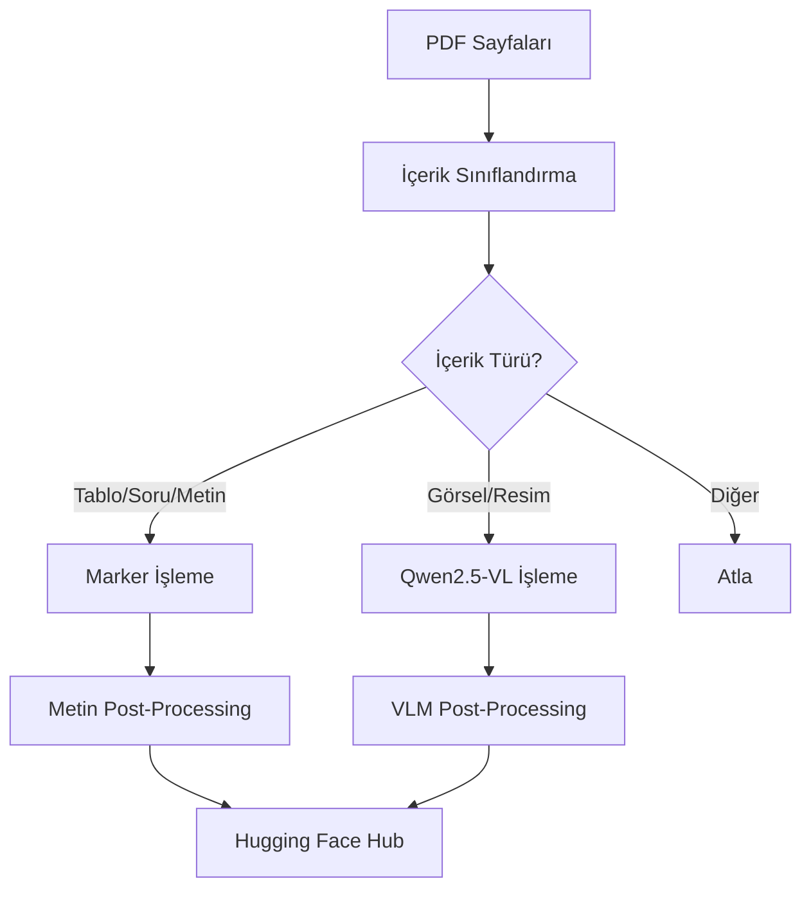

# PDF Router - Akıllı PDF İşleme Sistemi

Bu proje, PDF sayfalarını içerik türüne göre otomatik olarak sınıflandırıp, uygun işleme modüllerine yönlendiren akıllı bir sistemdir. Marker ve Qwen2.5-VL-32B gibi farklı AI modellerini kullanarak PDF içeriğini optimize edilmiş şekilde işler.

## 🚀 Özellikler

- **Akıllı Sınıflandırma**: PDF sayfalarını içerik türüne göre otomatik sınıflandırır
- **Çoklu İşleme Modülü**: Marker (tablo/soru/metin) ve Qwen2.5-VL (görsel içerik) desteği
- **Load Balancing**: Marker servisleri için round-robin yük dengeleme
- **Streaming İşleme**: Büyük veri setlerini bellek dostu şekilde işler
- **Hugging Face Entegrasyonu**: Sonuçları otomatik olarak HF Hub'a yükler
- **Hata Toleransı**: Robust hata yönetimi ve fallback mekanizmaları

## 📋 Gereksinimler

### Sistem Gereksinimleri
- Python 3.8+
- CUDA destekli GPU (Marker ve vLLM için)
- En az 4GB GPU RAM (önerilen: 8GB+)
- Yeterli disk alanı (geçici dosyalar için)

### Python Paketleri
```bash
pip install -r requirements.txt
```

Ana bağımlılıklar:
- `datasets` - Hugging Face veri setleri
- `vllm` - VLM modeli çalıştırma
- `openai` - API istemcisi
- `requests` - HTTP istekleri
- `loguru` - Loglama
- `PIL` - Görüntü işleme

## 🏗️ Kurulum

1. **Repository'yi klonlayın:**
```bash
git clone <repository-url>
cd pdf-router
```

2. **Gerekli paketleri yükleyin:**
```bash
pip install -r requirements.txt
```

3. **Environment değişkenlerini ayarlayın:**
```bash
# .env dosyası oluşturun
echo "HF_TOKEN=your_huggingface_token" >> .env
echo "VLLM_API_URL=http://localhost:8000" >> .env
echo "VLLM_API_KEY=your_api_key" >> .env
```

4. **Marker servislerini başlatın:**
```bash
# 4 farklı portta marker servisleri başlatır
sh start_marker_1.sh
```

5. **vLLM servisini başlatın:**
```bash
# Slurm ortamında
sh start_vllm_server.sh

# Veya doğrudan
sh start_vllm.sh
```

## ⚙️ Konfigürasyon

### `run.yaml` Dosyası
```yaml
model_name: "Qwen/Qwen2.5-VL-32B-Instruct"
ds_name: "orcn/predictions"                    # Giriş veri seti
output_ds_name: "sghosts/orcun_processed"      # Çıkış veri seti

# İşleme seçenekleri
use_vlm: true                                  # VLM kullan
use_marker: true                               # Marker kullan
debug: false                                   # Debug modu

# Streaming ve performans
streaming: true                                # Streaming modu
skip_existing: true                            # Mevcut split'leri atla
push_mode: overwrite                           # Çıkış modu (overwrite/append)
vlm_batch_size: 8                             # VLM batch boyutu
buffer_size: 256                              # RAM buffer boyutu

# GPU ayarları
tensor_parallel_size: 4                       # GPU sayısı
gpu_memory_utilization: 0.8                   # GPU bellek kullanımı
max_model_len: 32000                          # Maksimum model uzunluğu
```

## 🚀 Kullanım

### Temel Kullanım
```bash
python main.py run.yaml
```

### Tüm Servisleri Başlatma
```bash
# Marker + vLLM + Ana işlemi başlatır
sh run_job.sh
```

### Manuel Servis Başlatma
```bash
# 1. Marker servisleri
sh start_marker_1.sh

# 2. vLLM servisi
sh start_vllm_server.sh

# 3. Ana işlem
python main.py run.yaml
```

## 📊 İşleme Akışı



## 🏷️ İçerik Sınıflandırması

Sistem aşağıdaki içerik türlerini tanır:

| Sınıf | İşleme Modülü | Açıklama |
|-------|---------------|----------|
| `Tablo` | Marker | Tablo içeriği |
| `Soru` | Marker | Soru metinleri |
| `Metin` | Marker | Düz metin içerik |
| `Resim` | Qwen2.5-VL | Görsel içerik |
| `Resim/Tablo Açıklaması` | Qwen2.5-VL | Görsel açıklamaları |
| `Kapak Sayfası` | Qwen2.5-VL | Kapak sayfaları |
| `İçindekiler` | Atla | İçindekiler sayfası |

## 🔧 Marker Konfigürasyonu

Marker servisleri aşağıdaki parametrelerle çalışır:

```json
{
    "filepath": "/tmp/tmpbzniuzcs.png",
    "page_range": null,
    "languages": null,
    "force_ocr": true,
    "paginate_output": false,
    "output_format": "markdown"
}
```

### Load Balancing
- 4 farklı portta çalışan Marker servisleri
- Round-robin yük dengeleme
- Otomatik failover

## 📁 Çıktı Yapısı

### Hugging Face Hub
- **Hedef**: `https://huggingface.co/datasets/sghosts/orcun_processed`
- **Format**: Hugging Face Datasets
- **İçerik**: İşlenmiş metinler + metadata

### Log Dosyaları
```
logs/
├── marker_server_1.log    # Port 8001
├── marker_server_2.log    # Port 8002
├── marker_server_3.log    # Port 8003
├── marker_server_4.log    # Port 8004
└── vllm_server_*.log      # vLLM servisi
```

## 🛠️ Gelişmiş Kullanım

### Streaming Modu
```yaml
streaming: true
```
- Büyük veri setlerini bellek dostu işler
- Her split bittiğinde anında yükler
- RAM kullanımını optimize eder

### Batch İşleme
```yaml
streaming: false
vlm_batch_size: 8
```
- Tüm veriyi bellekte tutar
- Daha hızlı işleme
- Daha fazla RAM gerektirir

### Append Modu
```yaml
push_mode: append
```
- Mevcut verilerle birleştirir
- Duplicate kontrolü yapar
- Incremental güncelleme

## 🔍 Hata Ayıklama

### Log Kontrolü
```bash
# Marker servisleri
tail -f logs/marker_server_*.log

# vLLM servisi
tail -f logs/vllm_server_*.log
```

### Yaygın Sorunlar

1. **Marker servisleri başlamıyor**
   - GPU bellek kontrolü yapın
   - Port çakışması kontrolü

2. **vLLM bağlantı hatası**
   - `VLLM_API_URL` kontrolü
   - API key doğrulaması

3. **Hugging Face yükleme hatası**
   - `HF_TOKEN` kontrolü
   - İnternet bağlantısı

## 📈 Performans Optimizasyonu

### GPU Ayarları
```yaml
tensor_parallel_size: 4        # GPU sayısına göre ayarlayın
gpu_memory_utilization: 0.8    # Bellek kullanımını optimize edin
```

### Bellek Ayarları
```yaml
vlm_batch_size: 8              # VLM batch boyutu
buffer_size: 256               # RAM buffer boyutu
```

### Streaming vs Batch
- **Streaming**: Büyük veri setleri için
- **Batch**: Küçük veri setleri için

## 🤝 Katkıda Bulunma

1. Fork yapın
2. Feature branch oluşturun (`git checkout -b feature/amazing-feature`)
3. Commit yapın (`git commit -m 'Add amazing feature'`)
4. Push yapın (`git push origin feature/amazing-feature`)
5. Pull Request oluşturun

## 📄 Lisans

Bu proje MIT lisansı altında lisanslanmıştır.

## 🆘 Destek

Sorunlar için:
- Issue oluşturun
- Log dosyalarını paylaşın
- Sistem konfigürasyonunu belirtin

## 📚 Referanslar

- [Marker Documentation](https://github.com/VikParuchuri/marker)
- [vLLM Documentation](https://docs.vllm.ai/)
- [Qwen2.5-VL Model](https://huggingface.co/Qwen/Qwen2.5-VL-32B-Instruct)
- [Hugging Face Datasets](https://huggingface.co/docs/datasets/)